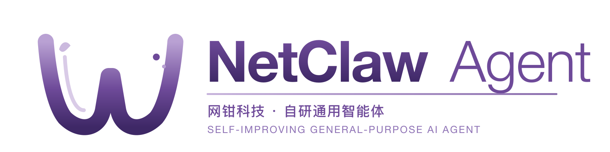

<!--
  NetClaw Agent — 网钳科技 AI 营销智能体
  README zh · Fork 结构 / upstream 拉取流程见 NETCLAW.md
-->

<p align="center">
  
</p>

<h1 align="center">NetClaw Agent · 网钳 AI 员工</h1>

<p align="center">
  <b>一个 AI 智能体&nbsp;&nbsp;·&nbsp;&nbsp;一支线上获客团队</b><br/>
  <i>Your first AI marketing employee — voice-driven, multi-platform, runs on your own desktop.</i>
</p>

<p align="center">
  <a href="https://github.com/netclawsec/netclaw-agent/blob/main/LICENSE"></a>
  <a href="https://github.com/netclawsec/netclaw-agent/issues"></a>
  <a href="https://netclawsec.com"></a>
</p>

---

**NetClaw Agent** 是 [网钳科技](https://netclawsec.com) 自研的 AI 营销智能体，把人工营销团队的工作流压缩到一个桌面 Agent 里——一句话指令，AI 帮你剪片、发布、抓评论、回私信、统计数据。

跨设备：Mac / Windows 桌面客户端 + 手机遥控；本地真 Chrome 登录态，无需扫码、无需 cookie 副本，平台风控视角与人工无异。

---

## ✨ 核心模块

| 模块 | 职责 | 技术亮点 |
|---|---|---|
| **AI 员工** | Codex 风极简对话框，输入 `/` 唤起 Skills 选择器；停止 / 追加 / 发送三色按钮；markdown 渲染 | DeepSeek-V3.2 / Claude / GPT；Skills 可扩展（ffmpeg / huashu-design / 自定义） |
| **自动发布** | 一份内容一次入队 fan-out 到抖音 / 小红书 / 视频号；多账号管理；发布记录全链路追踪 | 真 Chrome CDP + opencli；多账号 cookie 隔离 |
| **创意素材** | AI 内容工厂（图像 / 视频生成）+ 一键成片（FFmpeg 拼接 / 转场 / 字幕 / BGM）批量产出 N 条短视频 | FFmpeg `-protocol_whitelist` 安全沙箱；阿里云 OSS 永久 URL |
| **品牌洞察** | 9 平台并发搜集（百度 / 36kr / 小红书 / 抖音 / B 站 / 微博 / 知乎 / 豆瓣 / Google）+ 自动情绪分析 + 一键导出报告 | DeepSeek 标签分类；竞品监听 |
| **微信回复** | 多 AI 专家按白名单分配；金牌销售 SOP + 知识库驱动拟人聊天 | 提示词管理；多模型动态路由 |
| **数据分析** | 发布 / 互动 / 私域数据回流统一面板，多维筛选 | 跨平台 / 跨账号 |

---

## 🚀 快速开始

### macOS

```bash
# 下载 .app（最新 release 见 https://github.com/netclawsec/netclaw-agent/releases）
open "NetClaw Agent.dmg"
xattr -dr com.apple.quarantine "/Applications/NetClaw Agent.app"
open "/Applications/NetClaw Agent.app"
```

### Windows

下载并运行 `NetClaw-Agent-Setup.exe`，一路下一步即可。

### 自托管 / 开发

```bash
git clone https://github.com/netclawsec/netclaw-agent.git
cd netclaw-agent
pip install -e .
cd web && npm install && npm run build
netclaw web                # 启动 webui，默认 http://localhost:9119
```

---

## 🔐 License 与租户

- **多租户 License Server**：[license.netclawsec.com.cn](https://license.netclawsec.com.cn)
  - **超管** 创建 tenant + tenant_admin 账号
  - **租户管理员** 自助签发 NCLW key / 管理员工 / 看激活状态
  - **员工** 用 username + password 登录，JWT 24h 续期
- **激活方式**：员工登录后自动激活，或 CLI `netclaw license activate <NCLW-KEY>`
- 详见 [`license-server/MULTI-TENANT.md`](./license-server/MULTI-TENANT.md)

---

## 🏗 架构

```
┌─────────────────────────────────────────────────────────────┐
│  Mac / Windows .app  (PyInstaller + pywebview Cocoa)         │
│  ├─ webui (Python http.server-style)                         │
│  ├─ React + Vite SPA                                         │
│  └─ opencli + 真实 Chrome (CDP) — 接抖音 / 小红书 / 视频号    │
└─────────────────────────────────────────────────────────────┘
                            │ HTTPS
                            ▼
┌─────────────────────────────────────────────────────────────┐
│  License Server (Node + SQLite, pm2, Caddy + Let's Encrypt)  │
│  └─ 多租户 / NCLW + JWT seats / admin web UI                 │
└─────────────────────────────────────────────────────────────┘
                            │
                            ▼
┌─────────────────────────────────────────────────────────────┐
│  阿里云 OSS (cn-hangzhou) — 素材 / 渲染产物 永久 public-read │
└─────────────────────────────────────────────────────────────┘
```

---

## 🧩 Skills 体系

Skills 是 NetClaw Agent 的可扩展技能单元——一个目录 + `SKILL.md` 即可注入新能力，所有员工共享。

内置示例：
- [`ffmpeg-skill`](https://github.com/MastroMimmo/ffmpeg-skill) — 自然语言剪辑（cut / merge / subtitle / GIF / 水印 / speed）
- [`video-editing-skill`](https://github.com/6missedcalls/video-editing-skill) — trim / jump-cut / text overlay / silence removal
- `huashu-design` — HTML 高保真原型与品牌设计（PDF 介绍：[netclaw-agent-intro](https://netclawsec.com)）

放置路径：`~/.netclaw/skills/<name>/` 或 `~/.hermes/skills/<name>/`（自动 fallback）

---

## 📦 仓库结构

```
netclaw-agent/
├─ webui/             # web 后端 + REST API
├─ web/               # React + Vite SPA
├─ hermes_cli/        # CLI + license + employee auth
├─ packaging/
│  ├─ macos/          # .app + DMG 打包脚本
│  └─ windows/        # MSI 打包脚本
├─ license-server/    # 多租户 License Server (Node)
├─ agent/             # Agent 内核（prompt builder / 工具）
├─ acp_adapter/       # Agent ↔ MCP 协议适配
├─ cron/              # 定时任务
├─ gateway/           # 跨平台消息网关
└─ plugins/           # 插件（memory / honcho 等）
```

---

## 🤝 合作 / 商务

- **官网**：[netclawsec.com](https://netclawsec.com)
- **公司**：网钳科技（北京）有限公司 · 注册号 91110105099700839N
- **地址**：北京市朝阳区望京 SOHO 塔 2A 座 1511 室
- **邮箱**：beilei.zhang@netclawsec.com
- **电话**：010-53678223

---

## 📜 License

MIT — 详见 [LICENSE](./LICENSE)

部分组件继承自上游开源项目，license 信息见 [NETCLAW.md](./NETCLAW.md)。
